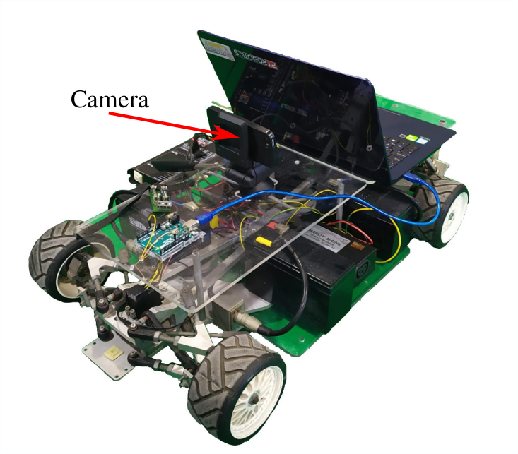

# Produtech
Core packages for the Produtech Project

# Table of Contents
- [Produtech](#produtech)
- [Table of Contents](#table-of-contents)
- [Overview](#overview)
- [Setup](#setup)
  - [1: Hardware](#1-hardware)
    - [Robot](#robot)
    - [Cameras](#cameras)
    - [Jetson AGX Xavier](#jetson-agx-xavier)
  - [2: Software](#2-software)
    - [maxon_des](#maxondes)
    - [ros-maxon-driver](#ros-maxon-driver)
    - [ros-panorama-package](#ros-panorama-package)
    - [faster-rcnn-data-matrix](#faster-rcnn-data-matrix)
    - [deepstream-application](#deepstream-application)
- [Known problems](#known-problems)
  - [High latency on the panorama image creation](#high-latency-on-the-panorama-image-creation)
  - [Lack of Deepstream-ROS interaction](#lack-of-deepstream-ros-interaction)
- [Publications](#publications)
- [Current Work](#current-work)

# Overview

One of the branches of the Produtech II SIF 24541 project is the T.6.3.3 - Development of a flexible and low-cost localization and navigation system for PPS6. So, the aim is to develop the core features of a visual-based navigation system. 
The prototyping system is composed of a small robot controlled through a remote controller that emulates an industrial AGV, and a set of programs developed for this system. The localization system works by detecting a constellation of visual landmarks (the Data-Matrices) which encode their absolute position reference frame. The system is able to co-locate in this constellation of marked by application of triangulation and trilateration techniques.

# Setup 

The setup of our robot is composed of two main parts: the hardware and the software. Regarding the hardware, the retrofitting of the Atlas MV robot consisted of disassembling the old robot and leaving only the interesting parts for the current project. Also, the existing software in terms of communication between the power chart and the engine was renewed. Finally, some of the novel core programming modules were built to perform the real-time self-robot localization.

## 1: Hardware

Here, the hardware parts and software modules used and developed during this project are described.

### Robot

In terms of hardware retrofitting the entire old electronic was changed by a simpler and actual one (e.g. the usage of an Arduino to do the communication between the Joystick and the steering AC motor). One of the initial setups of the robot can be seen in the figure below:

  

It is not possible to show an image of the final setup but some of the new hardware parts that compose the final robot version are described in the table below. 

|       Name        |                             Description/Function                             |
| :---------------: | :--------------------------------------------------------------------------: |
|  DC/AC Inversor   |                 Input 48 V, Output: AC. To power the Jetson.                 |
|  DC/DC Inversor   |                Input 12 V, Output: 5V. To power the Arduino.                 |
|      Arduino      | To perform the communication between the remote controller and the AC motor. |
| Jetson AGX Xavier |  To perform the DL computation and to ensure the ROS architecture running.   |
|   Four Cameras    |                               To acquire data.                               |

### Cameras

The cameras used to acquire the images can be seen in the figure below:

  

The [e-CAM130_CUXVR - Multiple Camera Board](https://www.e-consystems.com/nvidia-cameras/jetson-agx-xavier-cameras/four-synchronized-4k-cameras.asp) were conceived to acquire images with the [NVIDIA® Jetson AGX Xavier™](https://developer.nvidia.com/embedded/jetson-agx-xavier-developer-kit) board.

### Jetson AGX Xavier

This board enables the creation of AI applications mainly based on Deep Learning by incorporating 512-core Volta GPU with Tensor Cores and (2x) NVDLA Engines. The NVIDIA [Jetpack 4.2](https://developer.nvidia.com/jetpack-4_2) and the [DeepStream SDK 4.0](https://docs.nvidia.com/metropolis/deepstream/4.0/dev-guide/DeepStream_Development_Guide/baggage/index.html) were installed in this board to provide the software SDK required for this project (for example, the OpenCV library).

## 2: Software

Now, the set of software modules developed in this project are presented, from the low-level up to the high-level entire system.

### maxon_des

This is a library of functions to communicate with the [Maxon DES 70/10](https://www.maxongroup.com/maxon/view/product/228597) power chart. This set of functions includes:
* Status functions - Functions that allow checking the board status, list errors, clear these errors or reset/enable the board.
* Parameters functions - Functions to read and set some of the "static" parameters. 
* Setting functions -  Functions to set the current, (motor) velocity and stop the motor motion.

Resources: [REPO](https://github.com/tmralmeida/maxon_des)

Colaborators: [tmralmeida](https://github.com/tmralmeida) and [bernardomig](https://github.com/bernardomig) 

### ros-maxon-driver

This is the ROS driver to use those functions on the ROS-melodic framework. This driver translates the joystick inputs into the respective function call.

Resources: [REPO](https://github.com/tmralmeida/ros-maxon-driver)

### ros-panorama-package

Initially, the idea was to build a panorama image of the scenario through 3 input images. Then, the panorama image was processed through a Deep Neural Network that returns the location of the Data Matrix in the image. The complete process is developed as a ROS package, which is based on the [OpenCV PImage Stitching Project](https://www.pyimagesearch.com/2016/01/25/real-time-panorama-and-image-stitching-with-opencv/).

Resources: [REPO](https://github.com/tmralmeida/ros-panorama-package)

### faster-rcnn-data-matrix

This is a proof-of-concept notebook consisting of the entire training/testing pipeline of the FasterRCNN model through the [Detectron2](https://github.com/tmralmeida/detectron2) platform. To do so, the Dataset was manually created through the [labelbox](https://labelbox.com/) application.

Resources: [REPO](https://github.com/tmralmeida/faster-rcnn-data-matrix)

### deepstream-application

Finally, the board used in this project - Jetson AGX Xavier - allowed the study of another type of architectures to process the input images. The DeepStream framework delivers a complete streaming analytics toolkit for AI-based video and image understanding, as well as multi-sensor processing. Therefore, this SDK enables real-time inference through DNN, based on ONNX and Tensor RT libraries.

Thus, a DeepStream application was also developed based on those that were provided by NVIDIA. This application is a pipeline whose input is one image that then passes forward on the YoloV3 architecture. This object detection model outputs the bounding boxes of the respective objects in the scene.

Resources: [REPO]

# Known problems

In this section, the problems inherent to any part of the work are presented.

## High latency on the panorama image creation

Since the package developed w.r.t the panorama image creation uses [warp transformations](https://docs.opencv.org/2.4/modules/imgproc/doc/geometric_transformations.html#void%20warpPerspective(InputArray%20src,%20OutputArray%20dst,%20InputArray%20M,%20Size%20dsize,%20int%20flags,%20int%20borderMode,%20const%20Scalar&%20borderValue)) and they are sequentially deployed on the code, this implies a decrease of the rate ROS topic publication related to the panorama image. The solution could be parallelize those transformations.

## Lack of Deepstream-ROS interaction

There is no bridge between ROS and Deepstream at the time of this repo. Therefore, the construction of an entire architecture (e.g. autonomous vehicle) is difficult to achieve (because an autonomous vehicle is not based solely on video analytics). However, [jetson-inference](https://github.com/dusty-nv/jetson-inference) is a library with several deep-learning inference networks with TensorRT to deploy in the NVIDIA Jeston platform. These models can be used as [DL inference nodes](https://github.com/dusty-nv/ros_deep_learning).

# Publications

[Detection of Data Matrix Encoded Landmarks in Unstructured Environments using Deep Learning] - URL available soon  

# Current Work

The COVID-19 pandemic brought this work to a halt (due to the impossibility of contact with the robot), but enabled the development of another type of research on the field of autonomous driving (and connected with the AGV system). So, this work will be extended to autonomous driving applications. The visual perception of road agents/objects, based on DL ROS nodes, are going to be developed in the near future. Mainly, the two crucial objectives are to deploy a unified representation of the road/lanes segmentation and object detection.

Resources: 

Research Topics:

* Object Detection: [tmralmeida](https://github.com/tmralmeida)
* Semantic Segmentation for Road Detection: [bernardomig](https://github.com/bernardomig)