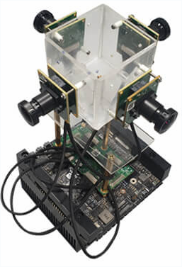

# agv-visual-localization
Core packages for the Produtech Project, where, initially, the objective was to build an AGV capable of getting its localization based on Artificial Vision  (Under construction)

# Table of Contents
- [Overview](#overview)
- [Table of Contents](#table-of-contents)
- [Setup](#setup)
  * [Hardware](#hardware) 
    * [Robot](#robot)
    * [Cameras](#cameras)
    * [Jetson AGX Xavier](#jetson-agx-xavier)
  * [Software](#software)
    * [maxon_des](#maxon_des)
    * [ros-maxon-driver](#ros-maxon-driver)
    * [ros-panorama-package](#ros-panorama-package)
    * [faster-rcnn-data-matrix](#faster-rcnn-data-matrix)
    * [deepstream-app](#deepstream-app)
- [Known problems](#known-problems)
  * [High latency on the panorama image creation](#high-latency-on-the-panorama-image-creation)
  * [Lack of Deepstream-ROS interaction](#lack-of-deepstream-ros-interaction)
- [Publications](#publications)
- [Current Work](#current-work)
  * [Object Detection](#object-detection)
  * [Semantic Segmentation](#semantic-segmentation)

# Overview

One of the branches of the Produtech II SIF 24541 project is the T.6.3.3 - Development of a flexible and low-cost localization and navigation system for PPS6. Therefore, the aim is to develop the core features of a visual-based navigation system. 
The prototype  is composed of a small robot controlled through a remote controller that emulates an industrial AGV, and a set of programs developed for this system. The localization system works by detecting a constellation of visual landmarks (Data Matrix), which encode their absolute position in relation to a reference frame. The system is able to self-locate in this constellation of markers by applying triangulation and trilateration techniques.

# Setup 

The setup of our robot is composed of two main parts: the hardware and the software. Regarding the hardware, the retrofitting of the Atlas MV robot consisted of disassembling the old robot and leaving only the interesting parts for the current project. Also, the existing software in terms of communication between the power chart and the engine was renewed. Finally, some of the novel core programming modules were built to perform the real-time self-robot localization.

## Hardware

Here, the hardware parts used and developed during this project are described.

### Robot

In terms of hardware retrofitting the entire old electronic was changed by a simpler and actual one (e.g. the usage of an Arduino to do the communication between the Joystick and the steering AC motor). One of the initial setups of the robot can be seen in the figure below:

  

It is not possible to show an image of the final setup but some of the new hardware parts that compose the final robot version are described in the table below. 

|       Name        |                             Description/Function                             |
| :---------------: | :--------------------------------------------------------------------------: |
|  DC/AC Inversor   |                 Input 48 V, Output: AC; To power the Jetson                  |
|  DC/DC Inversor   |                Input 12 V, Output: 5V; To power the Arduino                  |
|      Arduino      | To perform the communication between the remote controller and the AC motor. |
| Jetson AGX Xavier |  To perform DL computation and to ensure the ROS architecture running.       |
|   Four Cameras    |                               To acquire image data.                         |

### Cameras

The cameras used to acquire the images can be seen in the figure below:

  

The [e-CAM130_CUXVR - Multiple Camera Board](https://www.e-consystems.com/nvidia-cameras/jetson-agx-xavier-cameras/four-synchronized-4k-cameras.asp) were conceived to acquire images with the [NVIDIA® Jetson AGX Xavier™](https://developer.nvidia.com/embedded/jetson-agx-xavier-developer-kit) board.

### Jetson AGX Xavier

This board enables the creation of AI applications mainly based on Deep Learning by incorporating 512-core Volta GPU with Tensor Cores and (2x) NVDLA Engines. The NVIDIA [Jetpack 4.2](https://developer.nvidia.com/jetpack-4_2) and the [DeepStream SDK 4.0](https://docs.nvidia.com/metropolis/deepstream/4.0/dev-guide/DeepStream_Development_Guide/baggage/index.html) were installed in this board to provide the software SDK required for this project.

## Software

Now, the set of software modules developed in this project are presented, from the low-level up to the high-level entire system.

### maxon_des

This is a library of functions to communicate with the [Maxon DES 70/10](https://www.maxongroup.com/maxon/view/product/228597) power chart. This set of functions includes:
* Status functions - Functions that allow checking the board status, list errors, clear these errors or reset/enable the board.
* Parameters functions - Functions to read and set some of the "static" parameters. 
* Setting functions -  Functions to set the current, (motor) velocity and stop the motor motion.

Resources: [REPO](https://github.com/tmralmeida/maxon_des)

Colaborators: 

* [tmralmeida](https://github.com/tmralmeida) 
* [bernardomig](https://github.com/bernardomig) 

### ros-maxon-driver

This is the ROS driver to use those functions on the ROS-melodic framework. This driver translates the joystick inputs into the respective function call.

Resources: [REPO](https://github.com/tmralmeida/ros-maxon-driver)

### ros-panorama-package

Initially, the idea was to build a panorama image of the scenario through 3 input images. Then, the panorama image was processed through a Deep Neural Network that returns the location of the Data Matrix in the image. The complete process is developed as a ROS package, which is based on the [OpenCV PImage Stitching Project](https://www.pyimagesearch.com/2016/01/25/real-time-panorama-and-image-stitching-with-opencv/).
Resources: [REPO](https://github.com/tmralmeida/ros-panorama-package)

### faster-rcnn-data-matrix

This is a proof-of-concept notebook consisting of the entire training/testing pipeline of the FasterRCNN model through the [Detectron2](https://github.com/tmralmeida/detectron2) platform. To do so, the Dataset was manually created through the [labelbox](https://labelbox.com/) application.

Resources: [REPO](https://github.com/tmralmeida/faster-rcnn-data-matrix)

### deepstream-app

Finally, the board used in this project - Jetson AGX Xavier - allowed the study of another type of architectures to process the input images. The DeepStream framework delivers a complete streaming analytics toolkit for AI-based video and image understanding, as well as multi-sensor processing. Therefore, this SDK enables real-time inference through DNN, based on ONNX and Tensor RT libraries.

Thus, two DeepStream applications were also developed based on those that were provided by NVIDIA. These applications are pipelines whose input is one image that then passes forward on the YoloV3 architecture (in one of the applications a classical tracker is also used). This object detection model outputs the bounding boxes of the respective objects in the scene.

Resources: [REPO](https://github.com/tmralmeida/deepstream-app)

# Known problems :warning:

In this section, the problems inherent to any part of the work are presented.

## High latency on the panorama image creation

Since the package developed w.r.t the panorama image creation uses [warp transformations](https://docs.opencv.org/2.4/modules/imgproc/doc/geometric_transformations.html#void%20warpPerspective(InputArray%20src,%20OutputArray%20dst,%20InputArray%20M,%20Size%20dsize,%20int%20flags,%20int%20borderMode,%20const%20Scalar&%20borderValue)) and they are sequentially deployed on the code, this implies a decrease of the rate ROS topic publication related to the panorama image. The solution could be parallelize those transformations.

## Lack of Deepstream-ROS interaction

There is no bridge between ROS and Deepstream at the time of this repo. Therefore, the construction of an entire architecture (e.g. autonomous vehicle) is difficult to achieve (because an autonomous vehicle is not based solely on video analytics). However, [jetson-inference](https://github.com/dusty-nv/jetson-inference) is a library with several deep-learning inference networks with TensorRT to deploy in the NVIDIA Jeston platform. These models can be used as [DL inference nodes](https://github.com/dusty-nv/ros_deep_learning).

# Publications

* [Detection of Data Matrix Encoded Landmarks in Unstructured Environments using Deep Learning](https://www.researchgate.net/publication/341220437_Detection_of_Data_Matrix_Encoded_Landmarks_in_Unstructured_Environments_using_Deep_Learning)

# Current Work

The COVID-19 pandemic brought this work to a halt (due to the impossibility of contact with the robot), but enabled the development of another type of research on the field of autonomous driving (and connected with the AGV system). So, this work will be extended to autonomous driving applications. The visual perception of road agents/objects, based on DL ROS nodes, is going to be developed soon. Mainly, the two crucial objectives are to deploy a unified representation of the road/lanes segmentation and object detection.

Colaborators: 

* Object Detction: [tmralmeida](https://github.com/tmralmeida) 
* Semantic Segmentation: [bernardomig](https://github.com/bernardomig) 

## Object Detection

The object detection models deployed in this project were trained on the [BDD100k](https://bair.berkeley.edu/blog/2018/05/30/bdd/) dataset. Several developers have already implemented these models, so what is presented here are approaches based on those developed by these authors.

Resources: [REPO](https://github.com/tmralmeida/bag-of-models/tree/master/CNNs/2-Object_Detection/scripts)

* **Faster RCNN** :heavy_check_mark:

  Faster RCNN is one of the most widely used deep learning models for object detection. Although, its high-latency comparing to single-shot methods, Faster RCNN is performant detecting both small and large objects. The [authors](https://arxiv.org/abs/1506.01497) of this DL architecture divide the overall architecture into 2 modules, however, it is fairer to divide it into 3 modules:

  - feature maps extractor;
  - RPN (Region Proposals Network);
  - Fast RCNN detector;

  The former is composed of a traditional classification architecture, which is responsible for producing feature maps. In our approach we choose a MobileNetV2 to perform this task due to its low-latency. After that, a small network slides over the feature maps predicting multiple possible proposals for each of its cells. This small network returns a lower-dimensional feature, which is then fed to two 1 * 1 convolutional layers. These layers yield the probability of a proposal bounding a target, and the encoded coordinates of each proposal, respectively. Finally, the features that correspond to objects pass through an ROI pooling layer that crops and rescales each feature. During inference, the non-maximum suppression (NMS) algorithm is computed to filter out the best-located bounding boxes.  

  The work that we developed here in terms of training and model creation was based on the [torchvision](https://github.com/pytorch/vision/tree/master/torchvision) module of Pytorch framework.

  Numeric results based on [COCO](http://cocodataset.org/#detection-eval) metrics for object detection models on the BDD100K validation set:

  |       Metric             |  IoU Thresholds |  Scales  |  maxDets  | AP/AR values |
  | :----------------------: | :-------------: | :------: | :-------: | :----------: |
  | Average Precision  (AP)  |     0.50:0.95   |     all  |    100    |     0.202    |
  | Average Precision  (AP)  |     0.50        |     all  |    100    |     0.409    |
  | Average Precision  (AP)  |     0.75        |     all  |    100    |     0.175    |
  | Average Precision  (AP)  |     0.50:0.95   |   small  |    100    |     0.050    |
  | Average Precision  (AP)  |     0.50:0.95   |  medium  |    100    |     0.243    |
  | Average Precision  (AP)  |     0.50:0.95   |   large  |    100    |     0.432    |
  | Average Recall     (AR)  |     0.50:0.95   |     all  |      1    |     0.158    |
  | Average Recall     (AR)  |     0.50:0.95   |     all  |     10    |     0.277    |
  | Average Recall     (AR)  |     0.50:0.95   |     all  |    100    |     0.290    |
  | Average Recall     (AR)  |     0.50:0.95   |   small  |    100    |     0.116    |
  | Average Recall     (AR)  |     0.50:0.95   |  medium  |    100    |     0.355    |
  | Average Recall     (AR)  |     0.50:0.95   |   large  |    100    |     0.519    |

  Visual results on our roads: [video1](https://www.youtube.com/watch?v=mNZJJlK3pHM&t=1s) and [video2](https://www.youtube.com/watch?v=o7KSFDoEfW0&t=1s)

* **SSD** :heavy_check_mark:

  Single shot models can process the input faster due to the respective tasks - localization and classification - be done in a single forward fashion. Here, SSD is presented as well as its results in the validation set of the dataset used in this work. This architecture is characterized by its base network (or backbone), the usage of multi-scaled feature maps for the detection task, and the respective convolutional predictors. MobileNetV2 was used to perform the perception of the image features  and then was truncated before the classification layers. Hence, some of the final layers of MobileNet and additional feature layers allow predictions of detections at multiple scales. Each of these extra layers can produce a fixed set of detection predictions using a set of convolutional filters. Finally, the output of the model is the score for a category and the location of the box that bounds the target object.       

  Numeric results on the BDD100K validation set:

  |       Metric             |  IoU Thresholds |  Scales  |  maxDets  | AP/AR values |
  | :----------------------: | :-------------: | :------: | :-------: | :----------: |
  | Average Precision  (AP)  |     0.50:0.95   |     all  |    100    |     0.083    |
  | Average Precision  (AP)  |     0.50        |     all  |    100    |     0.131    |
  | Average Precision  (AP)  |     0.75        |     all  |    100    |     0.085    |
  | Average Precision  (AP)  |     0.50:0.95   |   small  |    100    |     0.002    |
  | Average Precision  (AP)  |     0.50:0.95   |  medium  |    100    |     0.044    |
  | Average Precision  (AP)  |     0.50:0.95   |   large  |    100    |     0.293    |
  | Average Recall     (AR)  |     0.50:0.95   |     all  |      1    |     0.068    |
  | Average Recall     (AR)  |     0.50:0.95   |     all  |     10    |     0.093    |
  | Average Recall     (AR)  |     0.50:0.95   |     all  |    100    |     0.093    |
  | Average Recall     (AR)  |     0.50:0.95   |   small  |    100    |     0.005    |
  | Average Recall     (AR)  |     0.50:0.95   |  medium  |    100    |     0.052    |
  | Average Recall     (AR)  |     0.50:0.95   |   large  |    100    |     0.334    |

  Although a huge difference between the numerical results for the validation set between the two architectures presented so far, this model is also performant on our roads. Please, check the videos below.

  Visual results on our roads: [video1](https://www.youtube.com/watch?v=DGnp-dfRaXU) and [video2](https://www.youtube.com/watch?v=cSvrMytWKd8)

  Problems: Small Objects Detection (due to the low resolution of the feature maps)
  Possible Solution: [Feature-Fused-SSD](https://github.com/wnzhyee/Feature-Fused-SSD) or the usage of FPNs.

* **YOLOV3** :heavy_check_mark:

  All YOLO architectures are also single-shot methods, and that is why they achieve high-speed predictions. The authors have been presenting several evolutions which is reflected in the amount of YOLO versions that exist - 4 until the writing date of this README file (YOLO, YOLOv2, YOLOv3, and YOLOv4). This architecture has always shown low-latency and, therefore what has been the focus on along the various versions is the localization performance. 
  
  Contrary to the previous architectures presented, YOLO has a custom features extractor - [Darknet](https://pjreddie.com/darknet/). This architecture can have different layouts, but the most common one is Darknet53 (from the third version of YOLO), which is 93.8% accurate on ImageNet test set (Top-5). Thus, v3 makes detections at three different scales by applying 1 * 1 kernels on those features maps at three different stages of the network:
   * the first detection is made by the 82nd layer (stride of 32). In our case, the input image has a size of 416 * 416, which means that the final detection feature map has a size of 13 * 13 * 45 (the number of channels is given by B * (5 + C), where B is the number of bounding boxes that a cell on the feature map can predict - 3; 5 is related to the object confidence, and the four values that determine the bounding box location; finally, C is the number of classes - 10 for BDD100K);
   * the second detection is made by the 94th layer, yielding a detection feature map of 26 * 26 * 45 (stride of 16);
   * finally, the last detection is made by the 106th layer, giving rise to a feature map of 52 * 52 * 45 (stride of 8);

   This last detection layer helped to improve small objects detection due to a higher resolution feature map (major problem in previous Yolo versions).   

* **YOLOV4** :x: 

## Semantic Segmentation
